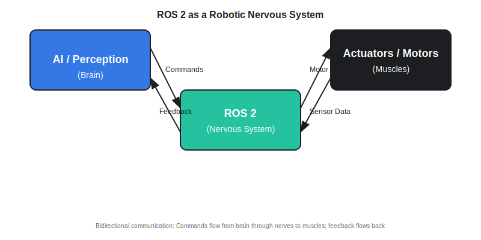

# ROS 2 as a Robotic Nervous System

Welcome to your first chapter on ROS 2! By the end of this chapter, you'll understand what ROS 2 is, why robots need it, and how it functions like a nervous system that connects a robot's "brain" to its "muscles."

## Learning Objectives

After completing this chapter, you will be able to:

- Define ROS 2 as middleware and explain why it is not an operating system
- Describe the nervous system analogy for ROS 2 architecture
- Explain how ROS 2 enables modular and distributed robot control
- Understand the specific role of ROS 2 in humanoid robotics

---

## What is ROS 2?

ROS 2 (Robot Operating System 2) is **middleware** that enables different software components of a robot to communicate with each other. Think of middleware as a translation layer that allows various programs to exchange information seamlessly, even if they're written in different programming languages or running on different computers.

:::note Definition
**Middleware**: Software that acts as a bridge between different applications or system components, enabling them to communicate and share data.
:::

It's crucial to understand that **ROS 2 is NOT an operating system** like Windows, Linux, or macOS. Instead, it runs on top of an operating system (typically Linux) and provides tools for building robot applications. You can think of it as a specialized communication framework designed specifically for robotics.

While traditional operating systems manage hardware resources like memory and processors, ROS 2 focuses on a different challenge: coordinating the many specialized software modules that modern robots require. A humanoid robot might need separate programs for vision processing, balance control, motion planning, and obstacle avoidance. ROS 2 makes these programs work together as a unified system.

---

## The Nervous System Analogy

To understand how ROS 2 works, imagine a humanoid robot as a human body with a nervous system. This analogy helps clarify the role of each component:

- **AI and Perception Systems = Brain**: The high-level intelligence that processes sensor data, makes decisions, and plans actions
- **ROS 2 Middleware = Nervous System**: The communication network that carries signals between the brain and the body
- **Actuators and Motors = Muscles**: The physical components that execute movements based on commands from the brain

Just as your nervous system carries electrical signals from your brain to your muscles (motor commands) and from your sensors back to your brain (sensory feedback), ROS 2 carries data messages between different parts of a robot system.

When you decide to pick up a cup, your brain sends commands through your nerves to the specific muscles in your arm and hand. Similarly, when a humanoid robot decides to pick up an object, its planning software sends commands through ROS 2 to the motor controllers in its robotic arm.

The nervous system also carries feedback. Your muscles and skin send information back to your brain about pressure, temperature, and position. In the same way, robot sensors send data through ROS 2 back to the perception and control systems, creating a continuous feedback loop that enables precise, adaptive movement.

---

## Modular and Distributed Robot Control

One of ROS 2's greatest strengths is enabling **modular architecture**. Instead of building one massive program that handles everything from vision to walking, developers can create separate, specialized modules that each do one thing well.

:::tip Key Concept
Modularity means breaking a complex system into smaller, independent parts that can be developed, tested, and replaced separately.
:::

For example, a humanoid robot might have separate modules for:

- **Vision processing**: Detecting objects, faces, and obstacles
- **Balance control**: Maintaining stability while standing or walking
- **Path planning**: Calculating safe routes around obstacles
- **Arm control**: Executing precise reaching and grasping motions
- **Speech recognition**: Understanding voice commands

Each module can be developed by different teams, tested independently, and even replaced with improved versions without affecting the rest of the system. This is similar to how you can upgrade your car's stereo without replacing the entire vehicle.

ROS 2 also supports **distributed processing**, where these modules can run on different processors or even different computers connected over a network. This is essential for humanoid robots because they have limited onboard computing power. Heavy computations like real-time vision processing might run on a powerful server, while simpler control loops run on lightweight computers embedded in the robot itself.

Distributed processing offers several advantages. First, it allows computationally expensive tasks to run on powerful hardware without weighing down the robot. Second, it enables redundancy: if one computer fails, others can potentially take over critical functions. Third, it makes development easier because programmers can test individual modules on their own computers before deploying them to the robot.

---

## ROS 2 in Humanoid Robotics

Humanoid robots present unique challenges that make ROS 2 particularly valuable. Unlike industrial robot arms that perform repetitive tasks in controlled environments, humanoid robots must coordinate dozens of joints simultaneously while adapting to dynamic, unpredictable surroundings.

Consider a humanoid robot walking across a room to hand you a cup of coffee. This seemingly simple task requires intricate coordination:

1. **Vision System**: Cameras identify you, locate the cup, and detect obstacles in the path
2. **Path Planning**: Software calculates a safe route from the starting point to your location
3. **Balance Control**: A real-time system maintains stability while walking, constantly adjusting to weight shifts
4. **Locomotion System**: Coordinates leg movements to execute the planned path
5. **Arm Control**: Reaches for the cup, grasps it with appropriate force, and hands it to you
6. **Safety Monitoring**: Continuously checks for unexpected obstacles or loss of balance

Without ROS 2, these systems would struggle to communicate effectively. The vision system needs to tell the path planner about obstacles. The balance controller needs instant feedback from the leg motors. The arm controller needs to know the robot's current position. ROS 2 provides the communication infrastructure that makes all of this possible in real-time.

Another concrete example is a humanoid robot performing a coordinated action like opening a door. The vision system must recognize the door handle and determine its position. The locomotion system must position the robot at the correct distance and angle. The arm system must reach for the handle with precise positioning. The grasp controller must apply the right amount of force. Throughout this process, the balance system must continuously adjust to maintain stability as the robot's weight distribution changes.

ROS 2 enables all these subsystems to share information seamlessly. When the vision system detects the door handle's location, it publishes this data through ROS 2. The path planning system subscribes to this data and calculates the approach trajectory. The arm controller subscribes to the handle's position and executes the reaching motion. If any subsystem detects a problem (loss of balance, obstacle detected, handle slipping), it can immediately inform the others through ROS 2, allowing the robot to adapt or abort the task safely.

---

## Key Takeaways

- **ROS 2 is middleware, not an operating system**. It provides communication tools for robot software but runs on top of a traditional OS like Linux.
- **The nervous system analogy** helps explain ROS 2's role: AI systems (brain) send commands through ROS 2 (nerves) to actuators (muscles), while sensors send feedback back to the AI.
- **Modular architecture** means breaking robot functionality into specialized, independent modules that communicate through ROS 2, making development easier and systems more maintainable.
- **Distributed processing** allows computationally intensive tasks to run on powerful computers while lightweight control runs on embedded systems in the robot.
- **Humanoid robotics** particularly benefits from ROS 2 because coordinating vision, balance, locomotion, and manipulation requires seamless real-time communication between many subsystems.

---

## Further Reading

- [ROS 2 Official Documentation](https://docs.ros.org/en/rolling/) - Comprehensive guide to ROS 2 concepts and features
- [ROS 2 Design](https://design.ros2.org/) - Technical design documents explaining architecture decisions
- [Why ROS 2?](https://docs.ros.org/en/rolling/The-ROS2-Project/Contributing/Developer-Guide.html) - Official explanation of improvements over ROS 1
