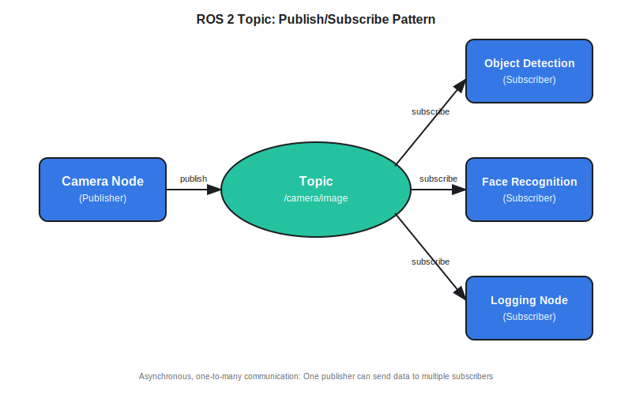
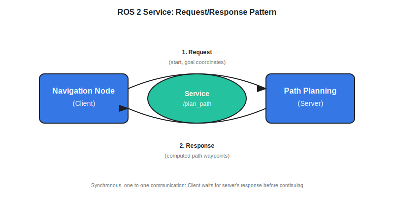

# ROS 2 Communication Primitives

In Chapter 1, you learned that ROS 2 acts as the nervous system connecting AI intelligence to robot hardware. But how exactly do different parts of a robot communicate through ROS 2? In this chapter, you'll discover the fundamental communication patterns that enable robots to coordinate sensors, AI decision-making, and physical movement.

## Learning Objectives

After completing this chapter, you will be able to:

- Explain what ROS 2 nodes are and why they run as independent processes
- Distinguish between topics (publish/subscribe) and services (request/response) communication patterns
- Identify when to use topics versus services in robot applications
- Understand how AI agents written in Python communicate with robot controllers via ROS 2
- Recognize the role of rclpy (the ROS 2 Python library) at a conceptual level

---

## ROS 2 Nodes: Independent Communicating Processes

Imagine a humanoid robot that needs to walk, maintain balance, recognize faces, and respond to voice commands—all simultaneously. How can one program handle all these tasks without becoming hopelessly tangled?

**Nodes** are the answer. A **node** is an independent process that performs a specific function in your robot system. Each node runs separately but communicates with other nodes through ROS 2. Think of nodes as specialists in an organization: one specialist handles vision, another handles balance, another handles speech recognition. They work independently but share information to accomplish complex goals.

:::note Definition
**Node**: An independent process in ROS 2 that performs a specific task (e.g., reading sensor data, processing images, controlling motors). Nodes communicate with each other through ROS 2's messaging system.
:::

Why independent processes? If one node crashes—say, your facial recognition node encounters an error—the other nodes keep running. Your robot might lose face detection temporarily, but it won't lose balance and fall over. This modularity makes robot systems more robust and easier to develop.

For example, a walking humanoid might have nodes for:

- **Vision node**: Processes camera images to detect obstacles
- **Balance node**: Monitors gyroscope data to maintain stability
- **Gait planning node**: Decides when and where to step
- **Motor control node**: Sends commands to leg actuators

Each node focuses on one job. They collaborate by exchanging messages.

---

## Topics: The Publish/Subscribe Pattern

How do nodes share information? The most common pattern in ROS 2 is the **topic**—a named channel where nodes can publish (send) and subscribe (receive) messages.

**Topics** work like a radio broadcast. One node (the **publisher**) sends messages on a specific channel. Any number of other nodes (the **subscribers**) can tune in to that channel and receive the messages. The publisher doesn't need to know who's listening, and subscribers don't need to know who's broadcasting.

:::note Definition
**Topic**: A named communication channel in ROS 2 where publishers send messages and subscribers receive them. Topics support asynchronous, one-to-many communication.
:::

:::note Definition
**Publisher**: A node that sends (publishes) messages on a topic.
:::

:::note Definition
**Subscriber**: A node that receives (subscribes to) messages from a topic.
:::

### How Topics Work

Consider a camera mounted on your humanoid robot's head. The camera node continuously captures images and publishes them on a topic called `/camera/image`. Multiple other nodes can subscribe to this topic:

- The object detection node subscribes to identify obstacles
- The face recognition node subscribes to detect people
- The logging node subscribes to record the video

The camera node doesn't care who's watching. It just broadcasts images as fast as it captures them. This is **asynchronous communication**—publishers and subscribers don't wait for each other.



**Key characteristics of topics**:

- **Asynchronous**: Publishers send messages without waiting for subscribers
- **One-to-many**: Multiple subscribers can receive the same messages
- **Continuous streams**: Best for frequently updated data (sensor readings, video frames, robot joint states)

### When to Use Topics

Use topics when you have:

- **Streaming data**: Sensor readings that update continuously (10–100 times per second)
- **Multiple consumers**: Different nodes need the same information
- **Fire-and-forget**: The publisher doesn't need to know if anyone received the message

---

## Services: The Request/Response Pattern

Sometimes a node needs to ask another node to perform a specific task and wait for the result. This is where **services** come in.

**Services** work like ordering food at a restaurant. You (the **client**) make a request ("I'd like a burger"), the kitchen (the **server**) processes your order, and returns a response ("Here's your burger"). You wait for your food—this is **synchronous communication**.

:::note Definition
**Service**: A communication pattern in ROS 2 where a client sends a request to a server and waits for a response. Services provide synchronous, one-to-one communication.
:::

:::note Definition
**Client**: A node that sends a request to a service.
:::

:::note Definition
**Server**: A node that receives service requests, performs computations, and sends responses back to clients.
:::

### How Services Work

Imagine your robot needs to calculate the best path to walk across a room without hitting furniture. A path planning node offers a service called `/plan_path`. When the navigation node needs a path, it acts as a client and sends a request with the current position and destination. The path planning server computes the route and responds with a sequence of waypoints.



**Key characteristics of services**:

- **Synchronous**: The client waits for the server's response before continuing
- **One-to-one**: Each request goes to exactly one server
- **On-demand computations**: Best for occasional calculations or queries

### When to Use Services

Use services when you have:

- **Infrequent requests**: You don't need continuous data, just occasional answers
- **Computational tasks**: Path planning, inverse kinematics, configuration queries
- **Confirmation needed**: You must know the task succeeded before proceeding

---

## Actions: Long-Running Tasks with Feedback

What if a task takes several seconds and you want progress updates along the way? **Actions** extend the service pattern with feedback and cancellation.

:::note Definition
**Action**: A communication pattern in ROS 2 for long-running tasks that provides feedback during execution and allows cancellation. Actions combine aspects of topics (feedback) and services (goals and results).
:::

For example, telling a humanoid robot to "walk to the kitchen" might take 30 seconds. An action allows:

- **Goal**: "Walk to kitchen coordinates (x=5, y=3)"
- **Feedback**: Progress updates every second ("50% complete, currently at x=2.5")
- **Result**: Final confirmation ("Arrived at kitchen") or failure ("Obstacle blocked path")
- **Cancellation**: Ability to stop mid-task ("Stop walking!")

Actions are beyond the scope of this introductory module, but it's helpful to know they exist for tasks that take time and need monitoring.

---

## Data Flow: AI Agents to Robot Controllers

Now let's connect the dots. How does an AI agent written in Python send commands to physical robot motors through ROS 2?

Here's the typical flow:

1. **AI Agent (Python)**: Your AI code decides the robot should raise its right arm
2. **ROS 2 Topic**: AI publishes a message on `/robot/joint_commands` topic with desired joint angles
3. **Motor Controller Node**: Subscribes to `/robot/joint_commands`, receives the target angles
4. **Hardware Interface**: Motor controller sends electrical signals to physical motors
5. **Actuators**: Servos move the arm to the commanded position

Meanwhile, sensor data flows the opposite direction:

1. **Sensors**: Joint encoders measure actual arm position
2. **Hardware Interface**: Reads encoder values
3. **Sensor Node**: Publishes current joint states on `/robot/joint_states` topic
4. **AI Agent**: Subscribes to `/robot/joint_states` to verify the arm reached the target

This bidirectional data flow—commands going down, sensor feedback coming up—enables closed-loop control. The AI can continuously adjust commands based on real-time sensor feedback.

---

## Introduction to rclpy: ROS 2 Python Library

How do you actually write Python code that publishes to topics or calls services? That's where **rclpy** (pronounced "are-see-ell-pie") comes in.

:::note Definition
**rclpy**: The ROS 2 client library for Python. It provides Python functions and classes for creating nodes, publishing to topics, subscribing to topics, and calling services.
:::

You don't need to master rclpy in this module—we're focused on understanding concepts, not writing production code. But here's a glimpse of what creating a simple publisher looks like:

```python
# Import the ROS 2 Python client library
import rclpy
from rclpy.node import Node
from std_msgs.msg import String

# Create a node that publishes messages
class SimplePublisher(Node):
    def __init__(self):
        super().__init__('simple_publisher')  # Node name
        # Create a publisher for the 'hello' topic
        self.publisher = self.create_publisher(String, 'hello', 10)
```

This snippet shows:

- Importing rclpy to access ROS 2 functionality
- Creating a node class (remember, nodes are independent processes)
- Setting up a publisher that sends messages on the `hello` topic

In later modules, you'll write complete nodes that control simulated humanoid robots. For now, just understand that Python code uses rclpy to interact with the ROS 2 communication system.

---

## Topics vs Services: Comparison

When should you use topics, and when should you use services? Here's a quick reference:

| Aspect | Topics | Services |
| -------- | -------- | ---------- |
| **Communication Pattern** | Publish/Subscribe | Request/Response |
| **Synchronization** | Asynchronous (fire-and-forget) | Synchronous (wait for response) |
| **Cardinality** | One-to-many (multiple subscribers) | One-to-one (single server) |
| **Data Flow** | Continuous streams | Occasional requests |
| **Use Case** | Sensor data, robot state | Computations, queries |
| **Example** | Camera images at 30 FPS | "Calculate path from A to B" |
| **Timing** | Publisher doesn't wait | Client waits for server |

**Rule of thumb**: If data updates frequently (multiple times per second), use topics. If you need an answer to a specific question, use services.

---

## Key Takeaways

- **ROS 2 nodes** are independent processes that each perform a specific function, making robot systems modular and fault-tolerant
- **Topics** implement publish/subscribe communication—asynchronous, one-to-many, ideal for continuous sensor data streams
- **Services** implement request/response communication—synchronous, one-to-one, ideal for on-demand computations
- **Actions** extend services for long-running tasks with feedback and cancellation (advanced concept for future study)
- AI agents use **rclpy** to create nodes and communicate through topics/services
- Choose topics for streaming data, services for occasional calculations, based on your robot's needs

---

## Further Reading

- [ROS 2 Concepts: Understanding Nodes](https://docs.ros.org/en/rolling/Concepts/Basic/About-Nodes.html) - Official ROS 2 documentation on nodes
- [ROS 2 Concepts: Understanding Topics](https://docs.ros.org/en/rolling/Tutorials/Beginner-CLI-Tools/Understanding-ROS2-Topics/Understanding-ROS2-Topics.html) - Deep dive into publish/subscribe
- [ROS 2 Concepts: Understanding Services](https://docs.ros.org/en/rolling/Tutorials/Beginner-CLI-Tools/Understanding-ROS2-Services/Understanding-ROS2-Services.html) - Deep dive into request/response
- [rclpy API Documentation](https://docs.ros.org/en/rolling/p/rclpy/index.html) - Reference for ROS 2 Python library
