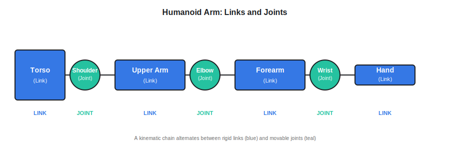
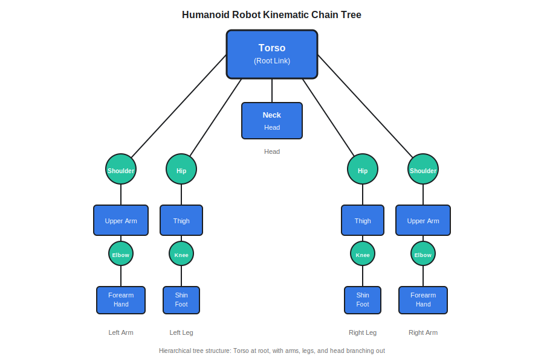

# Humanoid Robot Description with URDF

You've learned that ROS 2 connects AI software to robot hardware, and that nodes communicate through topics and services. But there's a fundamental question we haven't answered yet: how does software know what the robot's body looks like? How does a simulator know a humanoid has two arms, two legs, and where each joint can bend? The answer is **URDF**—the standard language for describing robot structure.

## Learning Objectives

After completing this chapter, you will be able to:

- Explain what URDF (Unified Robot Description Format) is and why robots need it
- Define links, joints, and kinematic chains using human body analogies
- Describe how a humanoid robot body is represented as a hierarchical tree structure
- Understand URDF's role in simulation, visualization, and control systems
- Recognize how URDF enables digital twins (virtual copies of physical robots)

---

## Purpose of URDF in Humanoid Robots

Just as a flight simulator needs aircraft specifications to produce realistic physics, robot simulators need detailed robot descriptions. **URDF (Unified Robot Description Format)** is the standard way ROS 2 describes robot structure for simulation, visualization, and control.

:::note Definition
**URDF**: Unified Robot Description Format—an XML-based file format used in ROS 2 to describe a robot's physical structure, including body parts (links), joints, dimensions, mass properties, and visual appearance.
:::

URDF files are machine-readable blueprints that specify:

- **What parts exist**: arm segments, leg segments, torso, head
- **How parts connect**: shoulder joint connects torso to upper arm
- **How parts can move**: elbow bends 0° to 150°, knee bends 0° to 140°
- **Physical properties**: each link's mass, center of gravity, inertia
- **Visual appearance**: 3D models for rendering

URDF provides a universal language across all simulation, visualization, and control tools.

### Why Humanoid Robots Need URDF

Humanoid robots are complex—they can have 20-40 joints (compared to 6-7 for industrial arms). URDF organizes this as a tree structure. Once written, URDF enables simulation in physics engines, 3D visualization, motion planning, and force calculations. Like architectural blueprints, URDF lets you test robots virtually before physical deployment.

---

## Links, Joints, and Kinematic Chains

To understand URDF, you need to understand three fundamental concepts: **links**, **joints**, and **kinematic chains**. The human body provides perfect analogies.

### Links: Rigid Body Parts

A **link** is a rigid body part that doesn't deform. In the human body, bones are links: your forearm bone, your upper arm bone, your thigh bone. These bones don't bend internally—they're solid structures.

:::note Definition
**Link**: A rigid body part of a robot that does not change shape. Links are connected by joints. Examples: upper arm segment, forearm segment, hand, torso, thigh, shin.
:::

In a humanoid robot, links might include:

- **Torso**: The central rigid body
- **Upper arm**: Shoulder to elbow
- **Forearm**: Elbow to wrist
- **Hand**: The end effector (gripper or fingers)
- **Thigh**: Hip to knee
- **Shin**: Knee to ankle
- **Foot**: The base that contacts the ground

Each link has properties like:

- **Geometry**: Shape and size (cylinder for arm, box for torso)
- **Mass**: Weight in kilograms
- **Inertia**: How the mass is distributed (affects rotation)
- **Visual model**: 3D mesh for rendering



### Joints: Connection Points with Motion

A **joint** connects two links and allows relative motion (like human elbows, knees, shoulders).

:::note Definition
**Joint**: A connection point between two links that defines how they can move relative to each other. Joints have types (revolute, prismatic) and limits (minimum/maximum angles).
:::

Common joint types:

- **Revolute joint**: Rotates like a hinge (elbow, knee)
- **Prismatic joint**: Slides linearly (telescope)
- **Fixed joint**: No movement (rigid sensor mount)

Humanoid arm example: shoulder connects torso to upper arm (3 DOF), elbow connects upper arm to forearm (1 DOF), wrist connects forearm to hand (2-3 DOF). Joints define parent-child relationships that create hierarchical structure.

### Kinematic Chains: Connected Sequences

A **kinematic chain** is a series of links connected by joints, forming a path from a base to an end point.

:::note Definition
**Kinematic Chain**: A sequence of links connected by joints that forms a mechanical path. Movement of joints in the chain affects the position and orientation of links further down the chain.
:::

Your arm is a kinematic chain: torso → upper arm (elbow joint) → forearm (wrist joint) → hand. When you bend your elbow, your hand moves. When you rotate your shoulder, both elbow and hand move. This is **dependent motion**—joints earlier in the chain affect everything downstream.

Humanoid robots have multiple chains: left/right arms (torso → shoulder → elbow → wrist → hand), left/right legs (torso → hip → knee → ankle → foot), and head (torso → neck → head).

---

## Representing Humanoid Body Structure

How does URDF organize all these links and joints? The answer is a **hierarchical tree structure**, with the torso (or base) as the root.

### The Robot Tree Hierarchy



In this tree:

- **Root link**: Torso (or pelvis)—the fixed reference point
- **Branches**: Arms, legs, and head extend from the torso
- **Leaves**: Hands and feet are the endpoints

Each joint connects a parent link to a child link:

- Shoulder joint: parent = torso, child = upper arm
- Elbow joint: parent = upper arm, child = forearm
- Wrist joint: parent = forearm, child = hand

This tree structure has important properties:

- **Single path to root**: From any link, there's exactly one path back to the torso
- **No loops**: Humanoid robots are tree structures (unlike closed-loop mechanisms)
- **Coordinate frames**: Each link has a coordinate system defined relative to its parent

When you move a joint, ROS 2 can calculate how all child links move by following the tree. If you rotate the shoulder, the upper arm, forearm, and hand all move together. If you bend the elbow, only the forearm and hand move.

### Degrees of Freedom

A humanoid robot's complexity is often described by its **degrees of freedom (DOF)**—the number of independent joint movements.

:::note Definition
**Degrees of Freedom (DOF)**: The number of independent motions a robot can make. Each revolute or prismatic joint adds one degree of freedom.
:::

A simple humanoid might have:

- 3 DOF per arm (shoulder, elbow, wrist) × 2 arms = 6 DOF
- 3 DOF per leg (hip, knee, ankle) × 2 legs = 6 DOF
- 2 DOF for head (pan, tilt) = 2 DOF
- **Total**: ~14 DOF

Advanced humanoids can have 30-50 DOF with multi-axis shoulders, hips, and finger joints. URDF handles this complexity by explicitly defining each joint.

---

## URDF, Simulation, Visualization, and Control

Now let's see how URDF enables three critical capabilities: simulation, visualization, and control.

### Simulation: Virtual Physics Testing

Simulators like **Gazebo** and **Isaac Sim** use URDF to create realistic physics. They read the robot's links (with mass and inertia), joints (with limits and dynamics), and compute how the robot moves under gravity, torques, and external forces.

For example, to simulate a humanoid walking:

1. URDF defines leg structure and joint limits
2. Simulator applies gravity to all links based on their mass
3. Control algorithm sends joint commands
4. Simulator calculates joint torques needed to achieve commanded angles
5. Physics engine updates link positions frame by frame

Without URDF's mass and inertia data, the simulator couldn't predict whether the robot would balance or fall.

### Visualization: 3D Rendering

Visualization tools like **RViz** use URDF to draw the robot in 3D. URDF includes references to mesh files (STL or DAE format) that define the robot's visual appearance. As joint states update (published on ROS 2 topics), RViz reads the current angles and renders the robot in its current pose.

This is invaluable for debugging: you can watch a live 3D visualization of your robot's movements, even if the physical robot is across the room or doesn't exist yet.

### Control: Respecting Physical Limits

Motion planning algorithms use URDF to avoid impossible commands. If URDF says the elbow can only bend 0° to 150°, the planner won't try to bend it to 180°. If URDF defines collision geometries, the planner can detect if the robot would hit itself or obstacles.

URDF turns abstract joint angles into meaningful physical constraints.

---

## Digital Twins and URDF

You'll hear the term **digital twin** frequently in modern robotics. A digital twin is a virtual copy of a physical robot that behaves identically to the real thing. URDF is the foundation that makes digital twins possible.

:::note Definition
**Digital Twin**: A virtual representation (simulation) of a physical robot that mirrors its structure, behavior, and state in real time. Digital twins enable safe testing and development without risking physical hardware.
:::

Here's how URDF enables digital twins:

1. **Identical structure**: URDF describes the physical robot's links, joints, and geometry exactly
2. **Synchronized state**: Real robot publishes joint states on ROS 2 topics → digital twin subscribes and mirrors the pose
3. **Parallel testing**: You can send commands to the digital twin first to verify safety before deploying to the physical robot

For example, if you develop a new walking gait algorithm:

- Test it first on the digital twin (URDF-based simulation)
- Verify the robot doesn't fall or damage joints
- If simulation succeeds, deploy the same code to the physical robot

URDF ensures the simulation accurately represents reality because both use the same structural description. In Module 2 and beyond, you'll work extensively with digital twins for humanoid robot development.

---

## Understanding URDF Syntax (Without Mastery)

You don't need to become a URDF authoring expert in this module—our goal is conceptual understanding. But let's look at a minimal example to demystify the XML syntax.

Here's a simplified URDF snippet for a single arm segment:

```xml
<!-- Define a simple robot with one arm segment -->
<robot name="simple_arm">

  <!-- Base link (shoulder attachment point) -->
  <link name="base_link">
    <visual>
      <geometry>
        <cylinder radius="0.05" length="0.1"/>
      </geometry>
    </visual>
    <inertial>
      <mass value="0.5"/>  <!-- 0.5 kg -->
    </inertial>
  </link>

  <!-- Upper arm link -->
  <link name="upper_arm">
    <visual>
      <geometry>
        <cylinder radius="0.03" length="0.3"/>  <!-- 30 cm long -->
      </geometry>
    </visual>
    <inertial>
      <mass value="1.2"/>  <!-- 1.2 kg -->
    </inertial>
  </link>

  <!-- Shoulder joint connects base to upper arm -->
  <joint name="shoulder_joint" type="revolute">
    <parent link="base_link"/>    <!-- Parent link -->
    <child link="upper_arm"/>      <!-- Child link -->
    <axis xyz="0 1 0"/>            <!-- Rotates around Y-axis -->
    <limit lower="-1.57" upper="1.57"/>  <!-- ±90 degrees in radians -->
  </joint>

</robot>
```

**What this snippet shows**:

- **Links** have geometry (shapes for rendering) and inertial properties (mass)
- **Joints** connect parent and child links with rotation axes and angle limits
- **Units**: Meters for length, kilograms for mass, radians for angles
- **XML structure**: Nested tags define hierarchical relationships

A complete humanoid URDF would have dozens of links and joints, plus collision geometries, material properties, and references to 3D mesh files. But the fundamental pattern is the same: links are parts, joints connect them, and properties define physics.

The key insight: you don't need to write URDF from scratch. Often, you'll use existing URDF files from robot manufacturers or modify templates. What matters is understanding what the structure represents.

---

## Key Takeaways

- **URDF** is the standard XML format for describing robot structure in ROS 2, enabling simulation, visualization, and control
- **Links** are rigid body parts (bones); **joints** are connections that allow motion (elbow, knee); **kinematic chains** are sequences of connected links and joints
- Humanoid robots are represented as **hierarchical trees** with the torso as the root and limbs as branches
- URDF enables **simulation** (physics testing), **visualization** (3D rendering), and **control** (respecting joint limits)
- **Digital twins**—virtual copies of physical robots—rely on URDF to accurately mirror real robot structure and behavior

---

## Further Reading

- [URDF Tutorial](http://wiki.ros.org/urdf/Tutorials) - Official ROS tutorials for understanding and creating URDF files
- [URDF XML Specification](http://wiki.ros.org/urdf/XML) - Complete reference for URDF tags and attributes
- [RViz: Visualizing URDF Models](https://docs.ros.org/en/rolling/Tutorials/Intermediate/URDF/Using-URDF-with-Robot-State-Publisher.html) - Learn to visualize your robot in 3D
- [Digital Twins in Robotics](https://arxiv.org/abs/2012.09165) - Academic paper on digital twin concepts (preview of Module 2)
